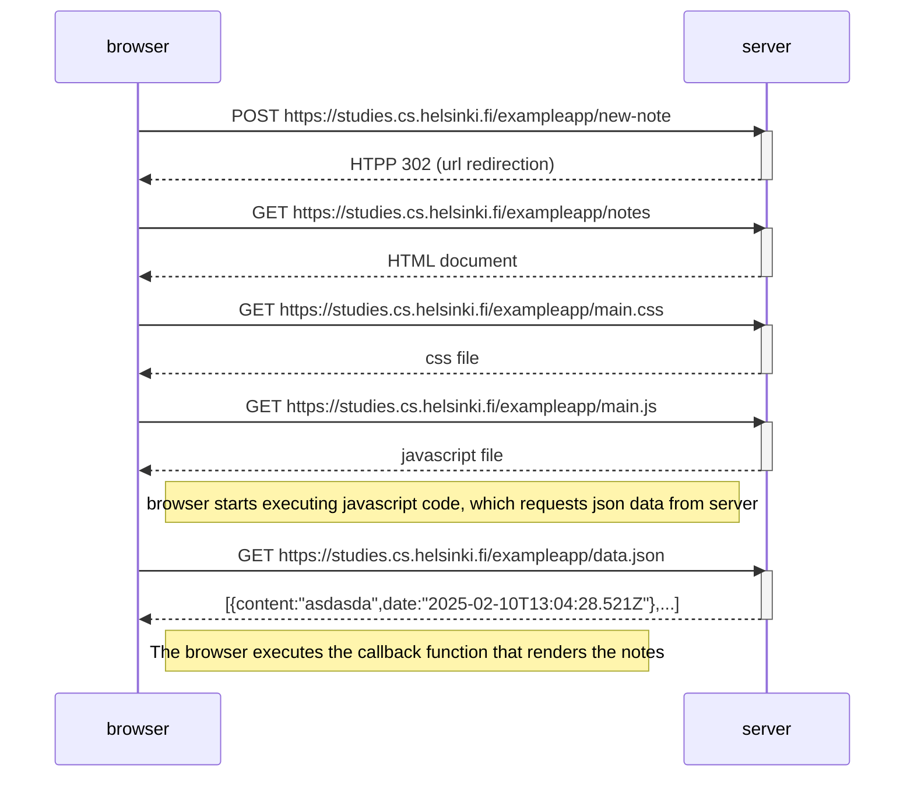

```mermaid

sequenceDiagram
    participant browser 
    participant server

    browser->>server: POST https://studies.cs.helsinki.fi/exampleapp/new-note
    activate server
    server-->>browser: HTPP 302 (url redirection)
    deactivate server

    
    browser->>server: GET https://studies.cs.helsinki.fi/exampleapp/notes
    activate server
    server-->>browser: HTML document 
    deactivate server

    browser->>server: GET https://studies.cs.helsinki.fi/exampleapp/main.css
    activate server
    server-->>browser: css file 
    deactivate server

    browser->>server: GET https://studies.cs.helsinki.fi/exampleapp/main.js
    activate server
    server-->>browser: javascript file 
    deactivate server


    Note right of browser :browser starts executing javascript code, which requests json data from server 

    browser->>server: GET https://studies.cs.helsinki.fi/exampleapp/data.json
    activate server
    server-->>browser: [{content:"asdasda",date:"2025-02-10T13:04:28.521Z"},...]
    deactivate server

    Note right of browser: The browser executes the callback function that renders the notes
```